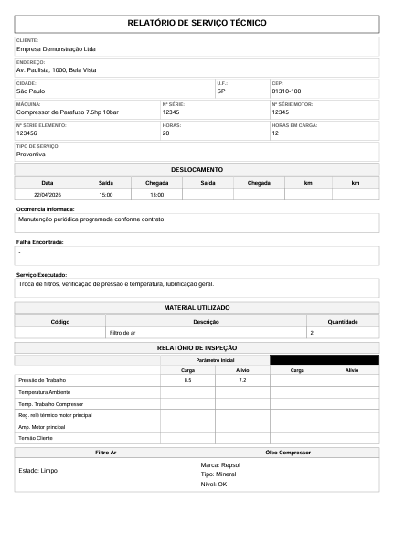
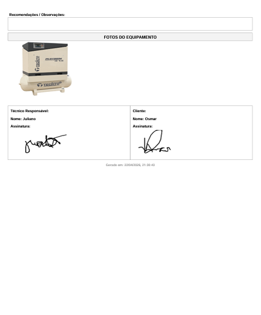

# Relatório de Serviço Técnico

Formulário web responsivo para técnicos preencherem o relatório de serviço técnico fiel ao documento original da empresa, coletar assinaturas digitais do cliente e do técnico, e gerar automaticamente um PDF profissional, tudo sem depender de internet ou aplicativo instalado.

---

## 📸 Preview




---

## Funcionalidades

- **Formulário único:** uma única tela com todos os campos do relatório original, sem etapas ou paginação
- **Dados do cliente:** nome/empresa, endereço, telefone, contato
- **Dados do equipamento:** tipo de máquina, número de série, nº de série do motor, nº de série do elemento e horas de operação
- **Tipo de serviço:** checkboxes (Manutenção Preventiva, Manutenção Corretiva, Instalação, Configuração, Visita Técnica, Outro)
- **Tabela de deslocamento:** registro de horários e percurso do técnico
- **Ocorrência informada:** descrição do problema relatado pelo cliente
- **Falha encontrada:** diagnóstico do técnico
- **Serviço executado:** descrição detalhada do serviço realizado
- **Material utilizado:** tabela com código, descrição e quantidade de cada item
- **Relatório de inspeção:** parâmetros técnicos com valores inicial e final (pressão, temperatura, corrente, tensão, etc.)
- **Filtro de ar e óleo compressor:** campos dedicados para registro de estado/troca
- **Recomendações:** campo livre para orientações ao cliente
- **Fotos do equipamento:** até 3 fotos por relatório, tiradas diretamente pela câmera do celular e incluídas automaticamente no PDF gerado
- **Assinaturas digitais** do técnico e do cliente via toque ou mouse (canvas de alta resolução)
- **Geração de PDF automática** com jsPDF, fiel ao layout do relatório original
- **100% offline** após o primeiro carregamento — sem backend, sem banco de dados

---

## Campos do Formulário

**Dados do Cliente**
- Nome / Empresa *(obrigatório)*
- Endereço *(obrigatório)*
- Telefone e Contato

**Dados do Equipamento**
- Máquina / Modelo *(obrigatório)*
- Nº de Série
- Nº de Série do Motor
- Nº de Série do Elemento
- Horas de Operação

**Tipo de Serviço** *(checkboxes — obrigatório)*
- Manutenção Preventiva
- Manutenção Corretiva
- Instalação
- Configuração
- Visita Técnica
- Outro

**Tabela de Deslocamento**
- Data, hora de saída, hora de chegada, km rodado ou local atendido

**Ocorrência Informada**
- Descrição do problema relatado pelo cliente

**Falha Encontrada**
- Diagnóstico técnico da causa raiz

**Serviço Executado**
- Descrição detalhada de tudo que foi realizado

**Material Utilizado**
| Código | Descrição | Quantidade |
|--------|-----------|------------|
| ...    | ...       | ...        |

**Relatório de Inspeção**
| Parâmetro | Valor Inicial | Valor Final |
|-----------|---------------|-------------|
| ...       | ...           | ...         |

**Filtro de Ar**
- Estado / Observação

**Óleo Compressor**
- Estado / Observação / Troca

**Recomendações**
- Campo livre para orientações ao cliente

**Fotos do Equipamento**
- Até 3 fotos por relatório, tiradas diretamente pela câmera do celular e incluídas automaticamente no PDF gerado
- Incluídas automaticamente no PDF gerado

**Assinaturas Digitais**
- Assinatura do técnico
- Assinatura do cliente

---

## Como usar

1. Abra o arquivo `ordem-de-servico.html` diretamente no navegador do celular ou computador — **não é necessário servidor**
2. Preencha todos os campos do formulário em uma única tela
3. Adicione os materiais utilizados e os parâmetros do relatório de inspeção
4. Anexe até 3 fotos do equipamento (opcional)
5. Colete a assinatura digital do cliente e assine como técnico
6. Clique em **"Gerar PDF"** — o documento é baixado automaticamente com todas as fotos incluídas

---

## Tecnologias

| Tecnologia | Uso |
|---|---|
| HTML5 | Estrutura e semântica |
| CSS3 | Layout responsivo, variáveis, animações |
| JavaScript (ES6+) | Lógica, validação, canvas e geração do PDF |
| [jsPDF](https://github.com/parallax/jsPDF) | Geração do documento PDF no navegador |
| Google Fonts — IBM Plex Sans / Mono | Tipografia |

Nenhum framework, nenhuma dependência local. Um único arquivo `.html`.

---

## Estrutura do PDF gerado

```
┌──────────────────────────────────────┐
│  RELATÓRIO DE SERVIÇO TÉCNICO        │  ← Cabeçalho com logo e data
├──────────────────────────────────────┤
│  DADOS DO CLIENTE                    │
│  DADOS DO EQUIPAMENTO                │
│  TIPO DE SERVIÇO                     │
│  TABELA DE DESLOCAMENTO              │
│  OCORRÊNCIA INFORMADA                │
│  FALHA ENCONTRADA                    │
│  SERVIÇO EXECUTADO                   │
│  MATERIAL UTILIZADO                  │
│  RELATÓRIO DE INSPEÇÃO               │
│  FILTRO DE AR / ÓLEO COMPRESSOR      │
│  RECOMENDAÇÕES                       │
│  FOTOS DO EQUIPAMENTO (até 3)        │
│  ASSINATURAS [Técnico]  [Cliente]    │
└──────────────────────────────────────┘
│  Gerado em DD/MM/AAAA HH:MM          │  ← Rodapé
└──────────────────────────────────────┘
```

---

## Estrutura do repositório

```
relatorio-tecnico/
└── ordem-de-servico.html   # Aplicação completa (HTML + CSS + JS)
```

---

## Privacidade

Todos os dados são processados **localmente no navegador**. Nenhuma informação é enviada para servidores externos. O PDF é gerado e salvo diretamente no dispositivo do usuário.

---

## Compatibilidade

Testado nos navegadores móveis modernos: Chrome para Android, Safari para iOS e Firefox. Requer conexão à internet apenas no primeiro acesso, para carregar a fonte IBM Plex e a biblioteca jsPDF via CDN.
